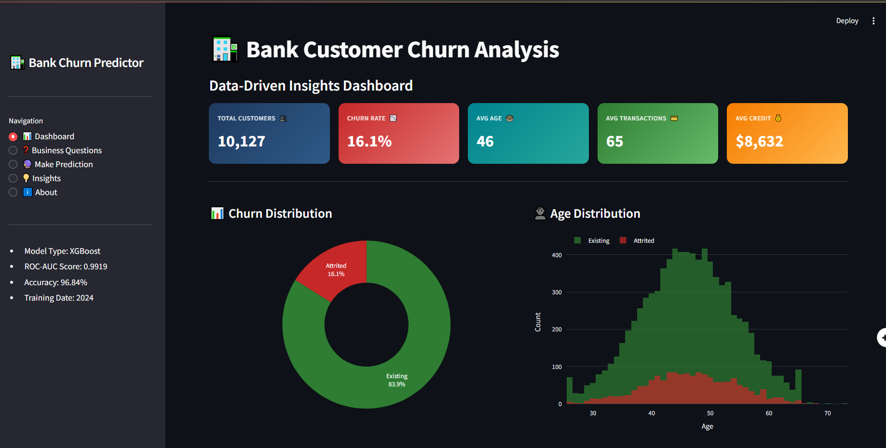
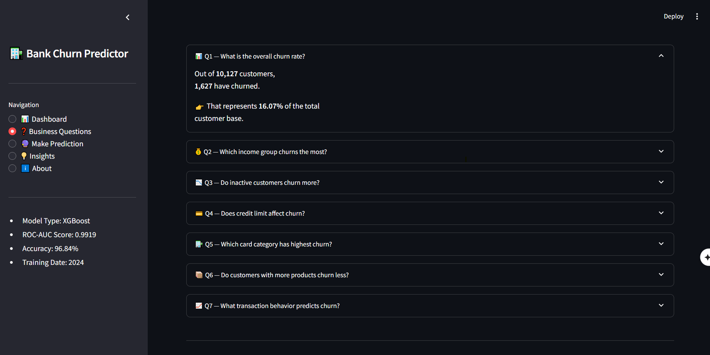
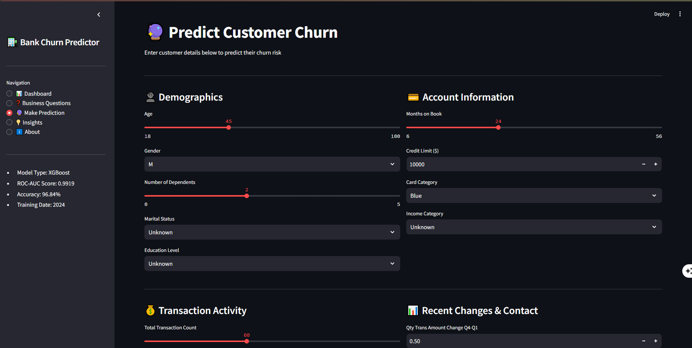
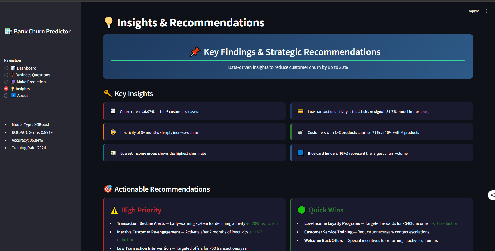

# 🏦 Bank Customer Churn Analysis & Prediction

<p align="center">


</p>

## 📖 Overview

This project delivers an end-to-end **Customer Churn Analytics Solution** for the banking sector. It combines **Exploratory Data Analysis (EDA), Machine Learning, Business Intelligence, and Interactive Visualization** to identify customers at risk of leaving and support data-driven retention strategies.

The solution includes:

- Comprehensive customer churn analysis
- Business-focused insights and recommendations
- XGBoost churn prediction model
- Interactive Streamlit dashboard
- Real-time churn prediction interface

---

# 🎯 Business Problem

Customer attrition directly impacts revenue, acquisition costs, and long-term growth.

The objective of this project is to:

- Understand the drivers behind customer churn.
- Identify high-risk customer segments.
- Predict churn before it happens.
- Enable proactive retention strategies.
- Support decision-making through interactive analytics.

---

# 🏗️ Solution Architecture

```text
                    ┌───────────────────┐
                    │   Raw Dataset      │
                    │ BankChurners.csv   │
                    └─────────┬─────────┘
                              │
                              ▼
                    ┌───────────────────┐
                    │ Data Preparation  │
                    │ Cleaning & EDA    │
                    └─────────┬─────────┘
                              │
                              ▼
                    ┌───────────────────┐
                    │ Feature Engineering│
                    └─────────┬─────────┘
                              │
                              ▼
                    ┌───────────────────┐
                    │ XGBoost Model     │
                    │ Training & Eval   │
                    └─────────┬─────────┘
                              │
                              ▼
                    ┌───────────────────┐
                    │ churn_model.pkl   │
                    └─────────┬─────────┘
                              │
                              ▼
                    ┌───────────────────┐
                    │ Streamlit App     │
                    │ Real-Time Predict │
                    └───────────────────┘
```

---

# 📂 Project Structure

```text
FINAL_PROJECT
│
├── Analysis
│   └── BankChurners_Analysis_Improved.ipynb
│
├── Prediction_Model
│   ├── BankChurners_model.ipynb
│   ├── churn_model.pkl
│   └── model_report.txt
│
├── Prediction_App
│   ├── churn_prediction_app.py
│   ├── churn_model.pkl
│   └── model_report.txt
│
├── Raw_Data
│   └── BankChurners.csv
│
└── Project_Presentation
    └── BankChurn_Presentation.pptx
```

---

# 📊 Dashboard Preview

## Main Dashboard

> Replace with your screenshot

```markdown

```

## Business Questions Page

```markdown

```

## Churn Prediction Page

```markdown

```

## Insights Page

```markdown

```

---

# 📈 Dataset Information

| Item | Value |
|--------|--------|
| Dataset | Bank Churners |
| Records | 10,127 |
| Target Variable | Attrition_Flag |
| Churn Rate | 16.07% |
| Features | 23+ |

### Key Features

- Customer Age
- Gender
- Income Category
- Education Level
- Marital Status
- Credit Limit
- Total Transaction Amount
- Transaction Count
- Months Inactive
- Card Category
- Utilization Ratio
- Relationship Count

---

# 🔍 Exploratory Data Analysis

The analysis phase focused on:

✅ Churn Distribution

✅ Customer Demographics

✅ Income Segmentation

✅ Card Category Analysis

✅ Transaction Behavior

✅ Credit Utilization

✅ Correlation Analysis

✅ Customer Retention Indicators

---

# 🤖 Machine Learning Model

## Selected Model

**XGBoost Classifier**

### Why XGBoost?

- High predictive performance
- Handles class imbalance effectively
- Strong generalization capability
- Fast inference time

---

# 📊 Model Performance

| Metric | Score |
|----------|----------|
| Accuracy | 96.84% |
| Precision | 90.40% |
| Recall | 89.85% |
| F1 Score | 90.12% |
| ROC-AUC | 99.19% |

---

# 📌 Feature Importance

Top predictors of churn:

1. Total Transaction Count
2. Total Transaction Amount
3. Months Inactive
4. Relationship Count
5. Credit Limit
6. Utilization Ratio

---

# 💡 Key Business Insights

### Customer Churn Characteristics

- Customers with lower transaction activity are significantly more likely to churn.
- Long inactivity periods strongly correlate with customer attrition.
- Customers holding fewer banking products have higher churn rates.
- Lower-income customer groups exhibit elevated churn risk.
- Blue card holders contribute the largest share of churn volume.

---

# 🚀 Business Impact

### Expected Benefits

| Initiative | Expected Impact |
|------------|----------------|
| Early Warning System | Reduce churn by identifying risk earlier |
| Retention Campaigns | Improve customer retention |
| Customer Segmentation | Better targeting and personalization |
| Product Cross-Selling | Increase customer lifetime value |
| Risk Monitoring | Improve strategic decision-making |

### Potential Outcomes

- Increased customer retention
- Reduced acquisition costs
- Higher customer lifetime value
- Improved customer engagement
- Data-driven business decisions

---

# 🖥️ Streamlit Application

### Features

#### 📊 Dashboard
- KPI Monitoring
- Churn Distribution
- Customer Behavior Analysis
- Correlation Heatmaps

#### ❓ Business Questions
- Overall churn rate
- Income analysis
- Inactivity analysis
- Credit limit impact
- Product relationship analysis

#### 🔮 Make Prediction
- Real-time churn prediction
- Risk scoring
- Probability visualization

#### 💡 Insights
- Strategic recommendations
- Risk distribution
- Retention opportunities

---

# ⚙️ Tech Stack

### Data Analysis
- Python
- Pandas
- NumPy

### Visualization
- Plotly
- Streamlit

### Machine Learning
- Scikit-Learn
- XGBoost
- Joblib

### Development Tools
- Jupyter Notebook
- VS Code
- Git & GitHub

---

# 🚀 Installation

## Clone Repository

```bash
git clone https://github.com/yourusername/bank-churn-analysis.git
cd bank-churn-analysis
```

## Install Dependencies

```bash
pip install pandas numpy scikit-learn xgboost plotly streamlit joblib
```

---

# ▶️ Run the Application

```bash
cd Prediction_App
streamlit run churn_prediction_app.py
```

Application will be available at:

```text
http://localhost:8501
```

---

# 📋 Future Improvements

- Model monitoring dashboard
- Automated retraining pipeline
- Cloud deployment (AWS/Azure)
- Customer recommendation engine
- Explainable AI (SHAP)

---

# 👩‍💻 Author

## Shaimaa

**Data Analyst | Scientific Computing Graduate**

### Connect With Me

- LinkedIn: https://www.linkedin.com/in/shaimaa-hesham
- GitHub: https://github.com/shaimaahesham
- Email: shaimaahesham647@gmail.com

---

# ⭐ Project Highlights

✔ End-to-End Analytics Project

✔ Business Intelligence Dashboard

✔ Machine Learning Prediction Model

✔ Streamlit Deployment

✔ Actionable Business Insights

✔ Portfolio-Ready Data Science Project

---

## 📄 License

This project is intended for educational, learning, and portfolio purposes.
